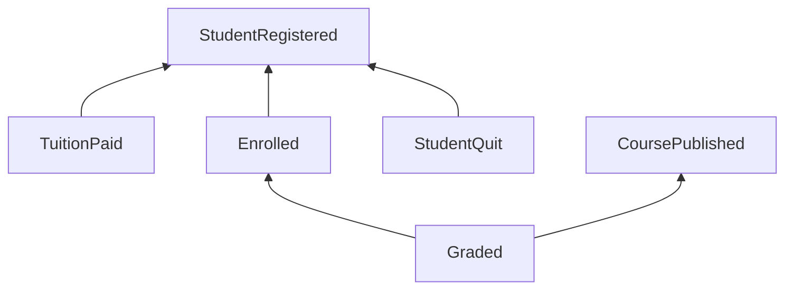

# No Entities

## 1.

```mermaid
flowchart BT
    TuitionPaid --> StudentRegistered
    Enrolled --> StudentRegistered
    Graded --> Enrolled
    StudentQuit --> StudentRegistered
    Graded --> CoursePublished
```

On Graded command, we need to summarise the state of the StudentRegistered to determine if the student is not quited.