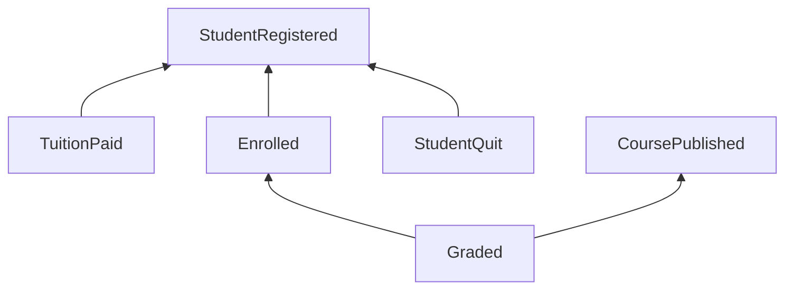

# No Entities

## 1.

```mermaid
flowchart BT
    TuitionPaid --> StudentRegistered
    Enrolled --> StudentRegistered
    Graded --> Enrolled
    StudentQuit --> StudentRegistered
    Graded --> CoursePublished
```

On `Grade` command, we need to summarise the state from the `StudentRegistered` to determine if the student is not quited.
